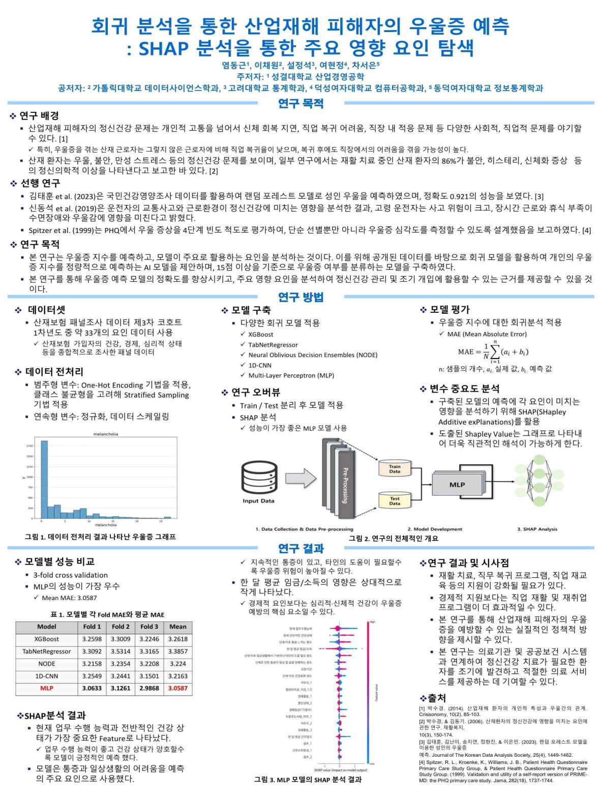

# 2025년 산재보험패널 데이터 기반 산업재해 피해자의 우울증 예측:회귀 분석과 SHAP 분석을 통한 영향 요인 탐색

### 연구 결과 포스터

  

## 연구 개요

산업재해 피해자의 정신건강, 특히 우울증은 신체 회복과 직업 복귀에 중요한 영향을 미칩니다.  
본 연구에서는 **2025년 산재보험패널 제3차 코호트 1차년도 데이터**를 활용하여  
**우울증 자가진단 점수(PHQ-9)** 를 예측하는 회귀 및 분류 모델을 구축하였습니다.

또한, **SHAP 분석**을 통해 모델 예측에 영향을 미치는 주요 요인을 시각화하고 해석하였습니다.

---

## 연구 목적

- 회귀 모델을 활용한 **우울증 점수(PHQ-9 총합) 예측**
- 기준 점수(15점 이상)를 바탕으로 한 **우울증 여부 이진 분류**
- **SHAP 분석**을 통한 주요 영향 변수 도출
- **SMOTE 기법**을 적용하여 데이터 불균형 문제 완화 및 성능 개선

---

## 연구 방법

- **데이터**: 산재보험패널 제3차 코호트 1차년도(V2)
- **모델**: MLP 기반 회귀 및 이진 분류 모델
- **전처리**: 결측값 처리, 범주형 인코딩, 정규화
- **불균형 처리**: SMOTE 오버샘플링 적용
- **성능 평가 지표**  
  - 회귀: MAE, RMSE  
  - 분류: Accuracy, F1-score, Recall, Precision  
- **해석 기법**: SHAP (Shapley Additive Explanations)

---

## 기술 스택

- Python  
- Pandas, NumPy  
- Scikit-learn, imbalanced-learn (SMOTE)  
- TensorFlow / Keras  
- SHAP  

---

## 파일 구성

| 파일명 | 설명 |
|--------|------|
| `2025_SanJaeInsurancePanel_Analysis_Poster.ipynb` | 데이터 전처리부터 모델링, 해석까지 전체 분석 과정 |
| `README.md` | 프로젝트 설명 |

---

## 참고 문헌

1. 박수경. (2014). 산업재해 환자의 개인적 특성과 우울간의 관계. *Crisisonomy, 10(2)*, 85-103.  
2. 박수경, 김동기. (2006). 산재환자의 정신건강에 영향을 미치는 요인. *재활복지, 10(3)*, 150-174.  
3. 김태훈 외 (2023). 랜덤 포레스트를 이용한 성인의 우울증 예측. *Journal of The Korean Data Analysis Society, 25(4)*, 1449-1462.  
4. 신동석. (2019). 산업재해 및 교통사고 특성 비교 연구 [한성대학교 박사학위논문].

---

## 시사점

- 정신건강을 조기에 예측함으로써 **맞춤형 재활 및 직업 복귀 프로그램 설계 가능성**을 확인하였습니다.  
- SHAP 분석을 통해 **정책적 개입이 필요한 주요 요인**을 도출할 수 있었습니다.  
- SMOTE 적용을 통해 **우울증 고위험군에 대한 예측 성능을 개선**하였습니다.
